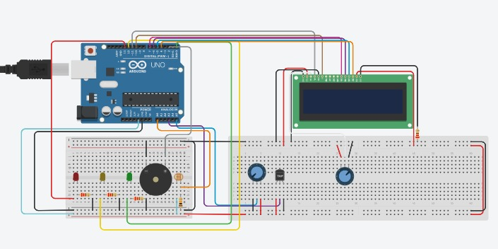

# Projeto CP02 - Monitoramento de Condições de Produção de Vinhos

Este é um projeto de Arduino que utiliza sensores para monitorar as condições de armazenamento de vinhos, incluindo temperatura, umidade e luminosidade. Com base nos dados obtidos pelos sensores, o projeto fornece indicações visuais e sonoras para auxiliar na manutenção das condições ideais de armazenamento.

## Desenvolvimento do Projeto

O projeto utiliza um Arduino UNO como placa de controle, juntamente com os seguintes componentes:

- Display LCD (com pinagem RS, E, D4, D5, D6, D7)
- Sensor de Luminosidade (LDR)
- Sensor de Umidade do Ar (Sensor de Humidade)
- Sensor de Temperatura (Termistor NTC)
- LEDs (verde, amarelo e vermelho)
- Buzzer

O código fornecido realiza a leitura dos sensores e exibe as informações no display LCD. Além disso, aciona os LEDs e o buzzer para fornecer indicações visuais e sonoras sobre as condições de armazenamento dos vinhos.

## Como Executar o Projeto

Para executar o projeto, siga os passos abaixo:

1. Faça a montagem do circuito de acordo com o esquema elétrico fornecido.
2. Faça o upload do código para o Arduino UNO utilizando a IDE do Arduino.
3. Abra o monitor serial da IDE do Arduino para visualizar as informações lidas pelos sensores.
4. Observe as indicações visuais no display LCD, LEDs e buzzer para monitorar as condições de armazenamento dos vinhos.

## Pré-requisitos

Para reproduzir este projeto, você precisará dos seguintes materiais:

- Arduino UNO ou compatível
- Display LCD 16x2
- Sensor de Luminosidade (LDR)
- Sensor de Umidade do Ar
- Sensor de Temperatura (Termistor NTC)
- LEDs (verde, amarelo e vermelho)
- Buzzer
- Jumpers e resistores conforme necessário

## Esquema Elétrico

Aqui está o esquema elétrico do projeto:

## Funcionamento

O projeto realiza a leitura dos sensores de luminosidade, umidade do ar e temperatura em intervalos regulares. Com base nos valores lidos, são acionados os LEDs e o buzzer para fornecer indicações visuais e sonoras sobre as condições de armazenamento dos vinhos. As informações também são exibidas no display LCD.

## Dificuldades

Durante o desenvolvimento do projeto, algumas dificuldades foram enfrentadas, como a calibração dos sensores, a escolha dos valores de referência para as condições ideais de armazenamento dos vinhos e a integração dos elementos de saída, como LEDs e buzzer, para fornecer indicações visuais e sonoras adequadas.

## Código

Aqui está o código utilizado no projeto:

Código completo no arquivo [`main.ino`](https://github.com/devCaiqueWS/vinheiria/edit/main/main.ino) do repositório

## Link do Vídeo Explicativo

Um vídeo explicativo sobre o projeto pode ser encontrado neste [link](???)

## Conclusão

O projeto de monitoramento de vinhos com Arduino é uma aplicação interessante para monitorar as condições de armazenamento de vinhos de forma eficiente e automática. Através do uso de sensores de temperatura e umidade, LEDs e indicadores sonoros, é possível obter informações em tempo real sobre as condições do ambiente de armazenamento dos vinhos.

Com a possibilidade de configurar alarmes para condições fora dos limites desejados, o projeto pode ajudar a prevenir danos aos vinhos causados por variações indesejadas de temperatura e umidade. Além disso, a interface de usuário simples e intuitiva torna o projeto fácil de usar, mesmo para aqueles que não têm experiência prévia com Arduino.

Este projeto pode ser expandido e personalizado de acordo com as necessidades e preferências individuais de cada usuário. É possível adicionar mais sensores, ajustar os limites de temperatura e umidade, e até mesmo integrar o projeto a um sistema de monitoramento remoto.

Em resumo, o projeto de monitoramento de vinhos com Arduino é uma aplicação prática e divertida para quem deseja monitorar e controlar as condições de armazenamento de seus vinhos de forma automatizada. É uma excelente maneira de utilizar as capacidades do Arduino em um projeto útil e interessante.

